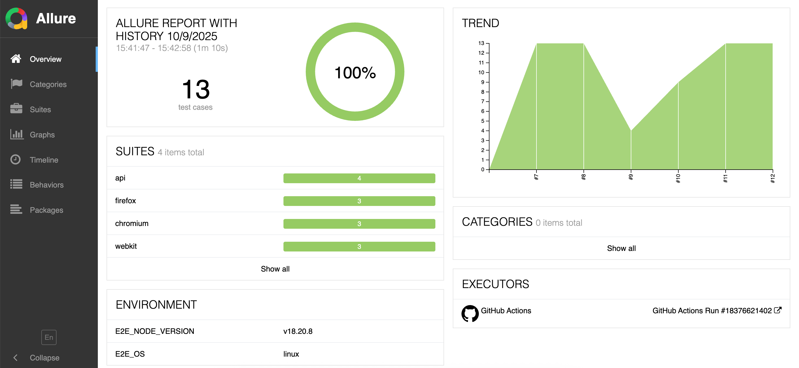
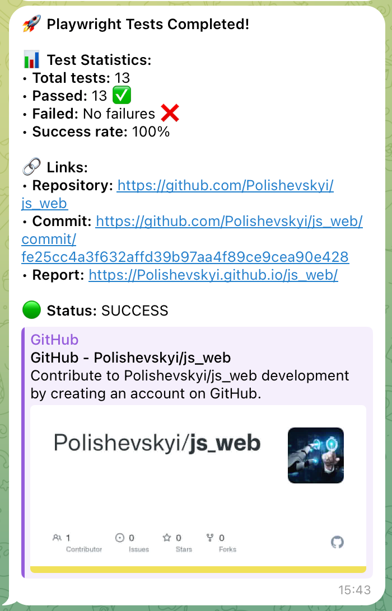

# Playwright Automation Framework for Web


🚀 Professional automation framework for web testing with Playwright, featuring Allure reporting, Page Object Pattern, API testing, and CI/CD integration.

## 📋 Table of Contents

- [Features](#-features)
- [Prerequisites](#-prerequisites)
- [Installation](#-installation)
- [Configuration](#️-configuration)
- [Running Tests](#-running-tests)
- [Project Structure](#-project-structure)
- [Architecture](#-architecture)
- [Reports](#-reports)
- [CI/CD](#-cicd)
- [Code Quality](#-code-quality)
- [Technologies](#-technologies)
- [Contributing](#-contributing)

## ✨ Features

- ✅ **E2E Testing**: Full UI automation with Page Object Pattern
- ✅ **API Testing**: Complete API test coverage with models
- ✅ **Cross-browser**: Test on Chromium, Firefox, and WebKit
- ✅ **Allure Reports**: Rich reporting with screenshots and videos
- ✅ **Data Generation**: Faker.js for dynamic test data
- ✅ **CI/CD Integration**: GitHub Actions with Telegram notifications
- ✅ **Code Quality**: ESLint + Prettier + Husky hooks
- ✅ **Fixtures**: Centralized fixtures for E2E and API
- ✅ **Logging**: Automatic step logging via Proxy
- ✅ **Parallel Execution**: Fast test execution with workers

## 📦 Prerequisites

- Node.js >= 18.0.0
- npm or yarn
- Git

## 🚀 Installation

```bash
# Clone the repository
git clone <repository-url>

# Navigate to project directory
cd js_web

# Install dependencies
npm install

# Install Playwright browsers
npx playwright install
```

## ⚙️ Configuration

### Environment Variables

Copy `.env.example` to `.env` and configure:

```bash
cp .env.example .env
```

Edit `.env` file:

```env
# E2E Configuration
BASE_URL=https://www.saucedemo.com
STANDARD_USER=standard_user
STANDARD_PASSWORD=secret_sauce

# API Configuration
API_BASE_URL=https://petstore.swagger.io/v2

# Telegram Notifications (Optional)
TELEGRAM_BOT_TOKEN=your_bot_token
TELEGRAM_CHAT_ID=your_chat_id
```

## ▶️ Running Tests

### E2E Tests

```bash
# Run E2E tests on Chrome
npm run test:e2e

# Run on all browsers
npm run test:e2e:all-browsers

# Run with visible browser
npm run test:headed

# Run on specific browser
npm run test:chrome
npm run test:firefox
npm run test:webkit
```

### API Tests

```bash
# Run API tests only
npm run test:api
```

### All Tests

```bash
# Run E2E (Chrome) + API tests
npm run test:all

# Run everything (all browsers + API)
npm test
```

## 🏗️ Project Structure

```
js_web/
├── 📁 config.js                    # Test configuration
├── 📁 playwright.config.js         # Playwright configuration
├── 📁 package.json                 # Dependencies
├── 📁 .env.example                 # Environment template
│
├── 📁 helpers/                     # Shared utilities
│   └── logger.js                   # Logging utilities
│
├── 📁 src/                         # Source code
│   ├── 📁 api/                     # API testing framework
│   │   ├── 📁 fixtures/
│   │   │   └── apiFixtures.js      # API fixtures
│   │   ├── 📁 models/              # Data models
│   │   │   ├── BaseModel.js
│   │   │   ├── CreatePetRequest.js
│   │   │   ├── CreatePetResponse.js
│   │   │   └── 📁 comparison/      # Model comparison
│   │   ├── 📁 steps/
│   │   │   └── petSteps.js         # Business logic
│   │   └── 📁 utils/               # HTTP utilities
│   │       ├── httpClient.js
│   │       ├── requester.js
│   │       ├── endpoints.js
│   │       ├── httpStatus.js
│   │       ├── constants.js
│   │       └── dataGenerator.js
│   │
│   └── 📁 e2e/                     # E2E testing framework
│       ├── 📁 fixtures/
│       │   └── e2eFixtures.js      # E2E fixtures
│       ├── 📁 pages/               # Page Objects
│       │   ├── BasePage.js
│       │   ├── LoginPage.js
│       │   ├── ProductsPage.js
│       │   ├── CartPage.js
│       │   └── CheckoutPage.js
│       └── 📁 utils/                # E2E utilities
│           ├── constants.js
│           └── dataGenerator.js
│
├── 📁 tests/                       # Test files
│   ├── 📁 e2e/                     # E2E tests
│   │   ├── login.spec.js
│   │   ├── shopping.spec.js
│   │   └── checkout.spec.js
│   └── 📁 api/                     # API tests
│       ├── createPet.spec.js
│       ├── getPet.spec.js
│       ├── updatePet.spec.js
│       └── deletePet.spec.js
│
└── 📁 .github/
    └── 📁 workflows/
        └── playwright-tests.yml    # CI/CD workflow
```

## 🎯 Architecture

### E2E Testing (UI)

**Page Object Pattern**

- ✅ Encapsulated page classes with business logic
- ✅ BasePage for common methods (click, fill, assertions)
- ✅ Separated locators from business logic
- ✅ Automatic logging via Proxy
- ✅ Centralized assertions

**Example:**

```javascript
const { test } = require('../src/e2e/fixtures/e2eFixtures');

test('User login flow', async ({ loginPage, productsPage }) => {
  await loginPage.navigate();
  await loginPage.login('standard_user', 'secret_sauce');
  await productsPage.assertProductsPageDisplayed();
});
```

### API Testing

**Steps Pattern**

- ✅ Business logic in steps (PetSteps)
- ✅ Models for request/response data
- ✅ Automatic model validation
- ✅ Flexible field comparison
- ✅ Centralized endpoints and status codes

**Example:**

```javascript
const { test, expect } = require('../src/api/fixtures/apiFixtures');
const { HTTP_STATUS } = require('../src/api/utils/httpStatus');

test('Create Pet API', async ({ petSteps, assertThatModels }) => {
  const { requestData, responseData, status } = await petSteps.createPet();

  expect(status).toBe(HTTP_STATUS.OK);
  await assertThatModels(requestData, responseData).match();
});
```

### Key Features

- 🔄 **Separation of Concerns**: E2E and API completely separated
- 📦 **Fixtures**: Centralized fixtures for both test types
- 🎲 **Data Generation**: Faker.js for dynamic test data
- 📝 **Logging**: Automatic step logging with Proxy
- ✅ **Assertions**: Centralized assertion methods
- 📊 **Reports**: Allure with screenshots, videos, and trends

## 📊 Reports

### Allure Report

```bash
# Generate Allure report
npm run allure:generate

# Serve report
npm run allure:serve

# Open existing report
npm run allure:open
```

**Report Preview:**



**Report Features:**

- 📸 Screenshots on failure
- 🎬 Video recording on failure
- 📝 Trace files for debugging
- 📈 Trends and categories
- 🌍 Environment information

## 🔄 CI/CD

### GitHub Actions

The framework includes a complete CI/CD pipeline with GitHub Actions.

**Features:**

- ✅ Parallel execution on multiple browsers
- ✅ 3 workers per browser
- ✅ 3 retries on failure in CI
- ✅ API tests run on single browser (browser-independent)
- ✅ Allure report generation and publishing
- ✅ Test artifacts retention (30 days)
- ✅ Environment variables from GitHub Secrets

**Setup GitHub Secrets:**

Add these secrets in repository settings:

- `BASE_URL` - Application URL
- `STANDARD_USER` - Test username
- `STANDARD_PASSWORD` - Test password
- `API_BASE_URL` - API base URL
- `TELEGRAM_BOT_TOKEN` - Bot token (optional)
- `TELEGRAM_CHAT_ID` - Chat ID (optional)

**Manual Trigger:**

You can manually trigger tests with workflow dispatch options:

- Browser: `all`, `chromium`, `firefox`, `webkit`
- Test type: `all`, `e2e`, `api`

### Telegram Notifications

Automatic Telegram notifications after CI/CD runs.

**Setup:**

1. Create bot via [@BotFather](https://t.me/BotFather)
2. Get chat ID from `https://api.telegram.org/bot<TOKEN>/getUpdates`
3. Add secrets: `TELEGRAM_BOT_TOKEN` and `TELEGRAM_CHAT_ID`

**Features:**

- 📊 Test statistics with success rate
- 🔗 Direct links to repository and report
- 🎨 HTML formatting for readability

**Notification Preview:**



## 🛠️ Code Quality

```bash
# Lint code
npm run lint

# Auto-fix lint issues
npm run lint:fix

# Format code
npm run format

# Check formatting
npm run format:check
```

## 🧪 Test Coverage

### E2E Tests

- ✅ **Login**: Authentication and logout flows
- ✅ **Shopping**: Add/remove items from cart
- ✅ **Checkout**: Complete checkout with generated data

### API Tests

- ✅ **Create**: Create pet and validate response
- ✅ **Read**: Get pet by ID
- ✅ **Update**: Update pet data
- ✅ **Delete**: Delete pet and verify

## 🛠️ Technologies

- **[Playwright](https://playwright.dev)** - E2E and API testing
- **[Allure](https://allurereport.org)** - Test reporting
- **[Faker.js](https://fakerjs.dev)** - Test data generation
- **[ESLint](https://eslint.org)** - Code quality
- **[Prettier](https://prettier.io)** - Code formatting
- **[Husky](https://typicode.github.io/husky)** - Git hooks
- **[GitHub Actions](https://github.com/features/actions)** - CI/CD

---

<div align="center">

Made with ❤️ by Polishevskyi

[](https://github.com/Polishevskyi)
[](https://www.linkedin.com/in/polishevskyi/)

</div>
